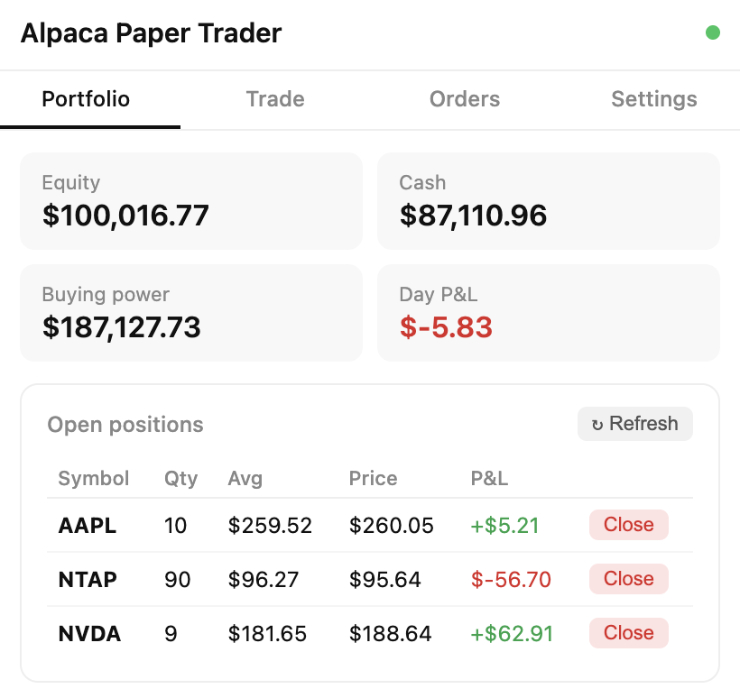
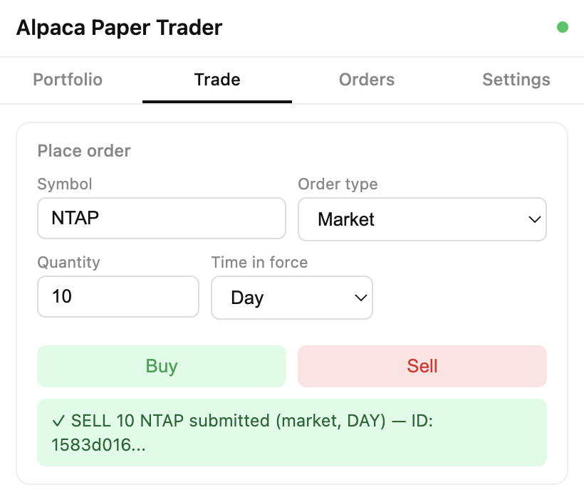
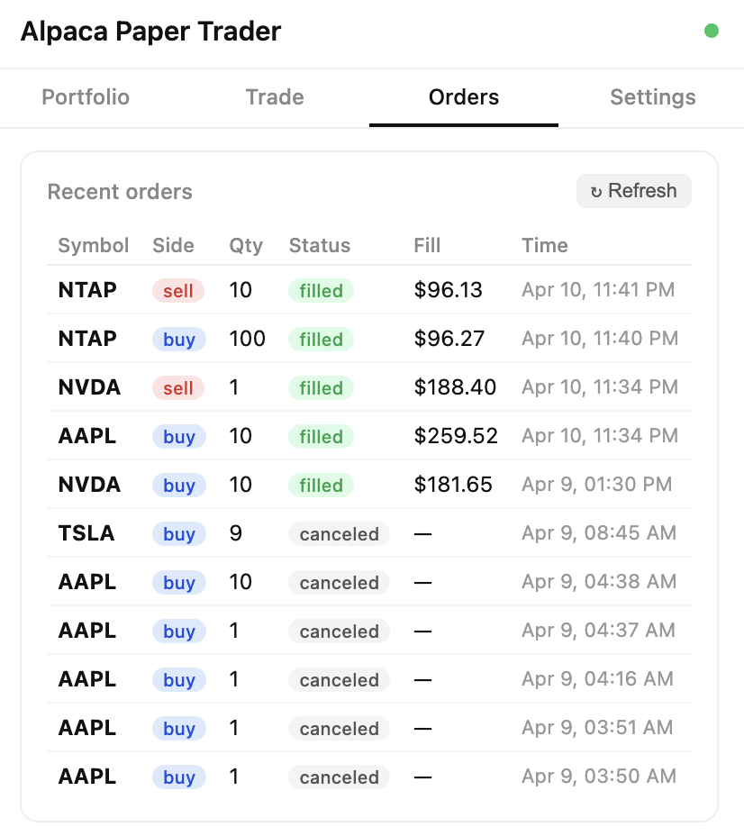

# Introduction

This is a trading app created as a Chrome plugin using Claude Code.

It connects to the Alpaca paper trading platform at the backend and allows the user to buy and sell stocks listed on the US stock exchange.

# Getting Started

In order to use the application, follow the steps described in the following sub-sections.

## Loading Chrome Plugin

Claude code creates the Chrome plugin as a zip file of all artifacts of the plugin.

Unzip the above file into a folder.

Open chrome://extensions in Chrome browser and activate "Developer mode".

Click on "Load unpacked" and give the name of the folder in which all artifacts of the application (Chrome extension) are placed.

## Configuring the Application

Click on the "Extensions" button on the Chrome navigation bar and select "Alpaca Paper Trader" extension. This would activate the extension.

If this is the first time this application is being run, go to the "Seetings" tab and provide Alpaca's API Key and Secret Key that we would have obtained from Alpaca, when we created the API Keys for the Paper Trading account.

## Dashboard

Click on the "Portfolio" tab to get a summary of our holdings and any Open Positions. If the market is closed, then any open positions will be settled next trading day, when the market opens. Note this is currently available only for NASDAQ.

It also provides information about the current cash position and the Day's P&L.

A sample screenshot is below:

## Start Trading

In order to place buy and/ or sell orders, click on the "Trade" tab.

A sample screenshot shows selling 10 stocks of NetApp Inc, whose symbol is NTAP on NASDAQ.

Other buy and sell orders had been placed to get to the current holdings as shown in the next section.

## Order Status

All executed and pending orders are shown on the "Orders" tab, along with its status and when it was settled.

A sample screenshot is below:

# Recorded Session

A .mov file containing a full session (screen recording) has also been uploaded. The file name starts with the prefix "Screen Recording".

