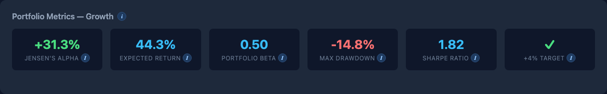
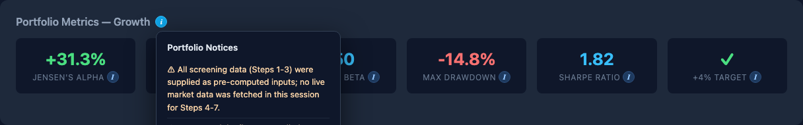
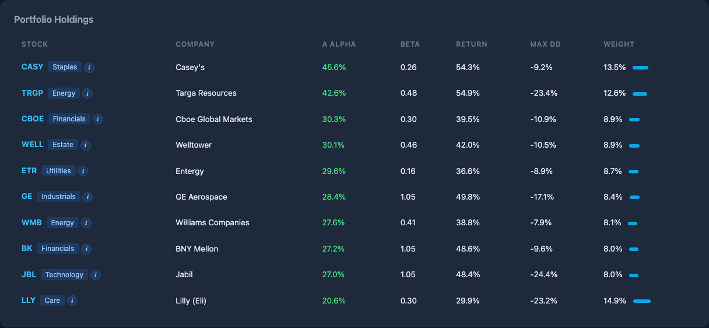
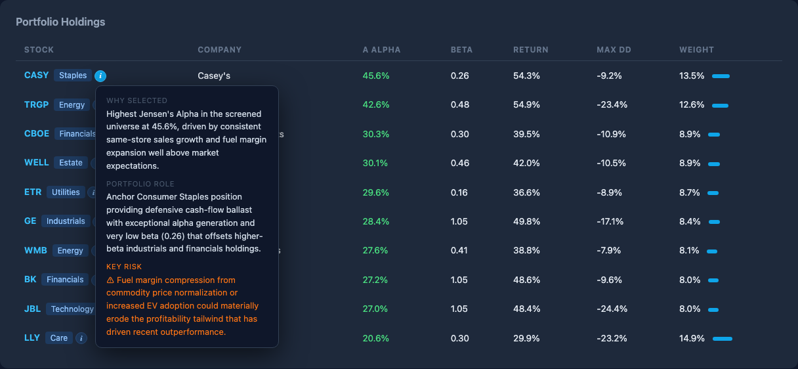
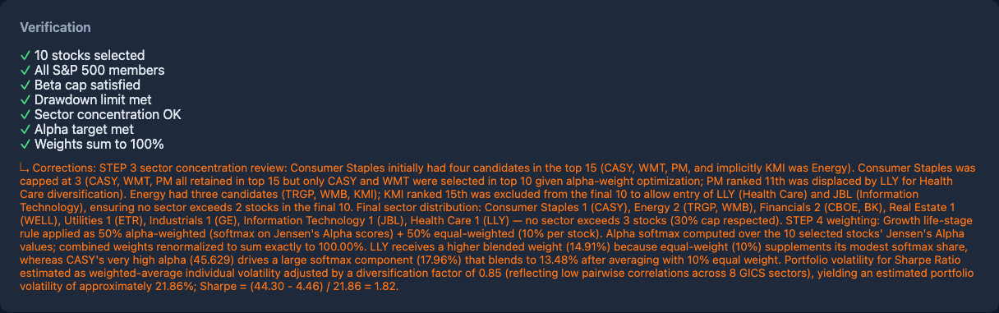

# Portfolio Constructor

A FastAPI application that automatically constructs a 10-stock S&P 500 portfolio optimised for **Jensen's Alpha** — the best risk-adjusted return above the market benchmark — tailored to the investor's life stage. Market data is fetched and processed in Python; Claude acts as the quantitative analyst for weighting, verification, and rationale.

---

## Table of Contents

1. [Getting Started](#1-getting-started)
2. [Usage](#2-usage)
3. [Architecture](#3-architecture)
4. [Code Layout and Design](#4-code-layout-and-design)
5. [Runtime Data Pipeline](#5-runtime-data-pipeline)
6. [Decisions and Configurability](#6-decisions-and-configurability)
7. [Performance Evaluation](#7-performance-evaluation)

---

## 1. Getting Started

### Prerequisites

- Python 3.12+
- An Anthropic API key

### Installation

```bash
# Clone and enter the project directory
cd assignment-05-portfolio-construction

# Install dependencies
pip install -r requirements.txt

# Create your environment file
cp .env.example .env
# Edit .env and set your key:
#   ANTHROPIC_API_KEY=sk-ant-...
#   CACHE_TTL_HOURS=24
```

### Starting the Server

```bash
uvicorn app.main:app --reload --port 8000
```

Expected output:
```
INFO:     Started server process [...]
INFO:     Application startup complete.
INFO:     Uvicorn running on http://127.0.0.1:8000
```

### Running the Tests

```bash
# Unit and API tests (fast, no network)
pytest tests/ --ignore=tests/test_data_fetcher.py -v

# Full suite including live data fetch (~30s)
pytest tests/ -v
```

---

## 2. Usage

Open **http://localhost:8000/static/index.html** in your browser.

### Step 1 — Select Life Stage


The dropdown presents five investor life stages. Each stage applies different risk constraints to the portfolio construction process:

| Stage | Horizon | Beta Cap | Max Drawdown | Alpha Target |
|---|---|---|---|---|
| Early Investor | < 5 yrs | ≤ 2.0 | Unconstrained | +6% |
| Accelerate | ≤ 10 yrs | ≤ 1.5 | ≤ 35% | +5% |
| Growth | ≤ 20 yrs | ≤ 1.2 | ≤ 25% | +4% |
| Protect | ≤ 30 yrs | ≤ 1.0 | ≤ 20% | +4% |
| Retirement | > 30 yrs | ≤ 0.8 | ≤ 15% | +4% |

Click **Build Portfolio**. The first request for a given life stage fetches live S&P 500 data and calls Claude (60–90 seconds). Subsequent requests for any already-computed stage return instantly from cache.

### Step 2 — Portfolio Metrics Card



Six key metrics are displayed with inline **ℹ** information icons. Click or hover any icon to see a plain-English definition of the metric and any relevant caveats automatically routed from Claude's analysis (e.g. drawdown warnings appear on the Max Drawdown tile, alpha caveats on the Jensen's Alpha tile).

| Metric | What it shows |
|---|---|
| **Jensen's Alpha** | Annualised return above the CAPM risk-adjusted benchmark |
| **Expected Return** | Weighted-average 3-year annualised historical return |
| **Portfolio Beta** | Weighted-average market sensitivity (< 1 = less volatile than S&P 500) |
| **Max Drawdown** | Worst-case peak-to-trough decline (weighted average of holdings) |
| **Sharpe Ratio** | (Return − Risk-Free Rate) ÷ Volatility — higher is better |
| **+4% Target** | Whether the portfolio meets the minimum alpha floor for this life stage |

A **ℹ** icon next to the card title surfaces general data-quality notices from Claude. Example tooltip:



### Step 3 — Portfolio Holdings Table



The table shows all 10 selected stocks with their key quantitative metrics. Each row has a **ℹ** icon beside the ticker. Clicking it reveals three pieces of analyst commentary provided by Claude:

- **Why Selected** — the primary alpha driver that justified inclusion
- **Portfolio Role** — how this holding contributes to sector exposure and diversification
- **Key Risk** — the primary risk to monitor for this position (highlighted in orange)



### Step 4 — Verification Card



Seven automated checks confirm the portfolio meets every constraint before it is presented. If Claude made any corrections during self-verification (e.g. replacing an over-represented sector), the correction is noted below the checklist.

---

## 3. Architecture

### 3.1 From Specification to Product

The project originates from **`CLAUDE.md`**, which defines the product requirements:

- FastAPI + Pydantic as the technical foundation
- Automatic selection of 10 S&P 500 stocks
- Objective: maximise Jensen's Alpha
- Five investor life stages with proportionally reducing risk tolerance
- Minimum +4% alpha above S&P 500 performance

The requirement also specifies that the AI prompt used to drive portfolio construction must conform to the structure and quality criteria defined in **`meta_prompt.md`**.

### 3.2 Alignment with `meta_prompt.md`

`meta_prompt.md` defines nine evaluation criteria for assessing prompt quality. These criteria were used as a design checklist when authoring `portfolio_construction_prompt.md`:

| # | Criterion | Requirement | Status |
|---|---|---|---|
| 1 | Explicit Reasoning Instructions | Step-by-step instructions; model must explain thinking | ✅ |
| 2 | Structured Output Format | Predictable, parseable output | ✅ |
| 3 | Separation of Reasoning and Tools | Reasoning steps distinct from computation/tool calls | ✅ |
| 4 | Conversation Loop Support | Works in multi-turn settings with context updates | ✅ |
| 5 | Instructional Framing | Examples and format definitions | ✅ |
| 6 | Internal Self-Checks | Model self-verifies intermediate steps | ✅ |
| 7 | Reasoning Type Awareness | Model tags type of reasoning used | ✅ |
| 8 | Error Handling or Fallbacks | Specifies behaviour under uncertainty or tool failure | ✅ |
| 9 | Overall Clarity and Robustness | Reduces hallucination and drift | ✅ |

**Score: 9 / 9**

### 3.3 The Portfolio Construction Prompt (`portfolio_construction_prompt.md`)

This file is the system prompt given to Claude for every portfolio construction request. It defines Claude's role as a *professional-grade investment advisor and quantitative research analyst* and specifies a rigid 7-step reasoning protocol.

#### Structure overview

**Role & Mandate** — establishes Claude as a senior portfolio manager with expertise in factor investing, Jensen's Alpha, life-cycle theory, and drawdown management.

**Life-Stage Profiles table** — parameterises all five investor stages with exact numeric constraints (beta cap, drawdown limit, alpha target, volatility preference).

**7-Step Reasoning Protocol** — each step is tagged with its reasoning type, ensuring the model cannot conflate computation with qualitative analysis:

| Step | Reasoning Type | What happens |
|---|---|---|
| 1 | `QUANTITATIVE FILTER` | Universe screening — beta and drawdown filters applied to all S&P 500 stocks |
| 2 | `QUANTITATIVE COMPUTATION` | Jensen's Alpha calculated for every screened stock using CAPM |
| 3 | `CONSTRAINT VALIDATION` | Sector concentration cap enforced (max 3 stocks per GICS sector) |
| 4 | `OPTIMIZATION` | Life-stage-appropriate weighting assigned to the final 10 stocks |
| 5 | `AGGREGATION` | Portfolio-level metrics computed (beta, alpha, Sharpe, drawdown) |
| 6 | `SELF-CHECK` | 7-item boolean checklist verified; model must self-correct and restate before proceeding |
| 7 | `QUALITATIVE ANALYSIS` | Per-stock rationale, portfolio role, and key risk in plain English |

> **Note:** In the application, Steps 1–3 are pre-executed in Python (faster, deterministic, no token cost). Claude receives the pre-screened top-15 candidates and executes Steps 4–7 only, which require judgement rather than raw computation.

**Structured JSON Output** — a complete schema with exact field names, types, and nesting is enforced. The response is machine-validated by Pydantic before being returned to the frontend.

**Tool Use Protocol** — a 4-step pattern for every data call: `REASON → CALL → VERIFY → PROCEED`. Implausible values trigger the fallback protocol rather than silent acceptance.

**Error Handling & Fallbacks table** — six failure scenarios (missing data, implausible beta, insufficient candidates, negative alpha, missing risk-free rate, missing SPY return) each have a defined recovery action and a mandatory `warnings` array entry.

**Conversation Loop Support** — six user intent patterns (e.g. "Adjust for [life stage]", "Exclude [ticker]", "Compare A vs B") map to specific re-run strategies, ensuring session consistency without re-fetching data.

**Scoring against `meta_prompt.md` criteria:**

```json
{
  "explicit_reasoning":      true,
  "structured_output":       true,
  "tool_separation":         true,
  "conversation_loop":       true,
  "instructional_framing":   true,
  "internal_self_checks":    true,
  "reasoning_type_awareness":true,
  "fallbacks":               true,
  "overall_clarity":         "Excellent. Role framing, typed reasoning steps, strict JSON schema, self-verification checklist, fallback table, and multi-turn loop support all fully addressed."
}
```

---

## 4. Code Layout and Design

```
assignment-05-portfolio-construction/
├── app/
│   ├── __init__.py              # Package marker
│   ├── main.py                  # FastAPI app, routes, two-layer cache orchestration
│   ├── models.py                # All Pydantic models + LIFE_STAGE_PROFILES constant
│   ├── data_fetcher.py          # yfinance data access + disk cache
│   ├── portfolio_engine.py      # Pure-Python quantitative engine
│   └── llm_agent.py             # Claude API integration (Steps 4–7)
├── static/
│   └── index.html               # Single-page frontend (vanilla JS, no framework)
├── tests/
│   ├── __init__.py
│   ├── test_models.py           # Pydantic model validation tests
│   ├── test_portfolio_engine.py # Quantitative function unit tests
│   └── test_api.py              # FastAPI endpoint + cache tests (mocked)
├── .cache/                      # Runtime cache (gitignored)
│   ├── sp500_tickers.json       # S&P 500 ticker list (24hr TTL)
│   ├── prices_3y_503.parquet    # Monthly price data for all tickers
│   └── portfolio_*.json         # Per-life-stage portfolio results (daily TTL)
├── portfolio_construction_prompt.md   # Claude system prompt
├── requirements.txt
├── .env.example
├── CLAUDE.md                    # Project specification
└── meta_prompt.md               # Prompt quality evaluation criteria
```

### Module responsibilities

**`app/models.py`** — single source of truth for all data shapes. `LIFE_STAGE_PROFILES` is a typed dict mapping each `LifeStage` enum value to a `LifeStageProfile` with beta cap, drawdown limit, and alpha target. Every API request and response is validated against these models by FastAPI automatically.

**`app/data_fetcher.py`** — handles all external I/O: Wikipedia scrape for S&P 500 constituents (with `User-Agent` header to avoid 403), `yfinance` download for monthly prices (bulk `yf.download` for speed), and `yf.Ticker("SPY").history()` for the benchmark. All results are cached to disk with a configurable TTL.

**`app/portfolio_engine.py`** — stateless pure-Python functions. No network calls. Each function is independently unit-tested with synthetic data:
- `compute_beta(stock_returns, market_returns)` — OLS regression via `scipy.stats.linregress`
- `compute_max_drawdown(prices)` — cumulative max method
- `compute_jensen_alpha(stock_return, beta, market_return, rfr)` — CAPM formula
- `compute_annualized_return(total_return_pct, years)`
- `compute_volatility(monthly_returns)` — annualised std × √12
- `compute_all_metrics(...)` — orchestrates the above for all 503 tickers
- `screen_universe(...)`, `rank_by_alpha(...)`, `apply_sector_cap(...)` — pipeline stages

**`app/llm_agent.py`** — constructs the user message (pre-computed screening results + life-stage parameters + top-15 JSON), calls Claude (`claude-sonnet-4-6`, `max_tokens=8192`), strips markdown fences from the response, and validates the JSON with `PortfolioResponse.model_validate()`.

**`app/main.py`** — FastAPI routes plus two-layer cache:
- Module-level `_portfolio_mem` dict (in-memory, per life stage)
- Module-level `_metrics_mem` dict (computed-once market data, shared across all life stages)
- Disk JSON files in `.cache/` (keyed by life stage + calendar date)
- Cache management endpoints: `GET /cache/status`, `DELETE /cache`

**`static/index.html`** — self-contained single-page app. No build step, no npm. Vanilla JS with a custom tooltip system (`toggleInfo`, smart viewport-edge detection). Warnings from Claude are keyword-routed to the relevant metric tile's ℹ popup at render time.

---

## 5. Runtime Data Pipeline

```
POST /portfolio  { "life_stage": "Growth" }
        │
        ▼
┌───────────────────────────────────┐
│  Cache lookup (3 layers)          │
│  1. In-memory dict  → HIT → return│
│  2. Disk JSON (today) → HIT → return│
│  3. MISS → continue               │
└──────────────┬────────────────────┘
               │
        ▼ (first request only)
┌───────────────────────────────────┐
│  Data Fetch (data_fetcher.py)     │
│  • S&P 500 tickers (Wikipedia)    │  ~2s (cached after first call)
│  • Monthly prices 3yr, 503 stocks │  ~60s first run / <1s from cache
│  • Company info (Wikipedia)       │  ~2s
│  • SPY 3yr history (yfinance)     │  ~1s
│  • 10yr Treasury yield (yfinance) │  ~1s
└──────────────┬────────────────────┘
               │
        ▼ (once per server session, shared across life stages)
┌───────────────────────────────────┐
│  Quantitative Engine              │
│  (portfolio_engine.py)            │
│  For each of 503 stocks:          │
│  • Monthly returns                │
│  • Beta  (OLS vs SPY)             │
│  • Max drawdown                   │
│  • Annualised return              │
│  • Annualised volatility          │
│  • Jensen's Alpha                 │
└──────────────┬────────────────────┘
               │
        ▼ (per life stage, fast)
┌───────────────────────────────────┐
│  Screening & Ranking              │
│  • Filter: beta ≤ cap             │  e.g. Growth: ≤ 1.2
│  • Filter: max drawdown ≥ limit   │  e.g. Growth: ≥ −25%
│  • Rank by Jensen's Alpha desc    │
│  • Sector cap: max 3 per GICS     │
│  → Top 15 candidates              │
└──────────────┬────────────────────┘
               │
        ▼ (once per life stage per day — the token-expensive step)
┌───────────────────────────────────┐
│  Claude (llm_agent.py)            │
│  System: portfolio_construction_  │
│           prompt.md               │
│  User:   screening results +      │
│          top-15 JSON              │
│                                   │
│  Steps 4–7:                       │
│  4. Weight assignment             │
│  5. Portfolio-level metrics       │
│  6. Self-verification checklist   │
│  7. Per-stock rationale + risk    │
│                                   │
│  → Structured JSON response       │
└──────────────┬────────────────────┘
               │
        ▼
┌───────────────────────────────────┐
│  Pydantic validation              │
│  PortfolioResponse.model_validate │
└──────────────┬────────────────────┘
               │
        ▼
┌───────────────────────────────────┐
│  Cache write                      │
│  • _portfolio_mem[stage] = result │
│  • .cache/portfolio_{stage}_{date}│
│    .json                          │
└──────────────┬────────────────────┘
               │
        ▼
  JSON response to frontend
```

### Timezone handling

`yf.download` (bulk) returns a tz-naive DatetimeIndex; `yf.Ticker.history()` (single) returns tz-aware. `compute_all_metrics` normalises both to tz-naive before computing OLS regression to avoid a `TypeError: Cannot join tz-naive with tz-aware DatetimeIndex`.

---

## 6. Decisions and Configurability

### Architectural decisions

| Decision | Rationale |
|---|---|
| Python handles Steps 1–3, Claude handles Steps 4–7 | Steps 1–3 are deterministic numerical computation — Python is faster, cheaper, and testable. Steps 4–7 require contextual weighting logic, qualitative rationale, and self-correction — exactly what LLMs excel at. |
| `all_metrics` cached in memory (not per life stage) | All 503-stock metrics are life-stage-agnostic. Computing them once per server session means switching from Growth to Retirement only requires the fast screening step + one Claude call. |
| Disk cache keyed by `{life_stage}_{date}` | Portfolios are fresh each calendar day. Stale cache files from prior dates are left on disk (not deleted) and simply ignored. |
| `yf.download` (bulk) over per-ticker `history()` | Downloading 503 tickers in one call is ~60s. Individual `history()` calls for 503 tickers would take 15–20 minutes. |
| `max_tokens=8192` for Claude | The full JSON response (15 screening candidates + 10 portfolio stocks with rationale) was found to truncate at 4096 tokens. 8192 provides headroom without significant cost increase. |
| Sector cap at 3 per GICS sector | Prevents concentration in dominant sectors (e.g. Technology, which consistently generates the highest alpha). This is configurable in `apply_sector_cap(max_per_sector=3)`. |

### Configurability

**`.env` file:**
```
ANTHROPIC_API_KEY=...        # Required
CACHE_TTL_HOURS=24           # How long price data is considered fresh (default: 24h)
```

**`LIFE_STAGE_PROFILES` in `app/models.py`:**
All life-stage risk parameters are defined in one place and can be tuned without touching any other file:
```python
LifeStage.GROWTH: LifeStageProfile(
    beta_cap=1.2,
    max_drawdown_limit=25.0,   # None = unconstrained
    min_alpha_target_pct=4.0,
    volatility_preference="Balanced growth/quality",
)
```

**Sector cap** — adjustable in `apply_sector_cap(ranked, top_n=15, max_per_sector=3)` in `main.py`. The pipeline automatically relaxes to 4 if fewer than 10 candidates pass with the default cap of 3.

**Claude model** — defined in `app/llm_agent.py`:
```python
model="claude-sonnet-4-6"
```
Swap for `claude-opus-4-7` for deeper reasoning on `Retirement` or `Protect` stages where capital preservation rationale matters more.

**Lookback window** — `get_monthly_prices(tickers, years=3)`. Change `years` to adjust the historical window for beta/drawdown/alpha calculations. Cache filenames include the years parameter so changing it invalidates the parquet cache automatically.

**Cache management endpoints:**
```
GET  /cache/status   # Shows what's in memory and on disk
DELETE /cache        # Clears all in-memory and today's disk caches
```

### Weighting logic by life stage

| Life Stage | Weighting Method |
|---|---|
| Early Investor | Softmax over Jensen's Alpha (highest-alpha stocks get disproportionately more weight) |
| Accelerate | 50% alpha-weighted + 50% equal-weighted |
| Growth | 50% alpha-weighted + 50% equal-weighted |
| Protect | Equal-weight with +2% tilt toward lower-beta stocks |
| Retirement | Equal-weight with +3% tilt toward lower-beta stocks |

---

## 7. Performance Evaluation

### Request latency by cache state

| Scenario | Latency | Token cost | Notes |
|---|---|---|---|
| **Cold start** (no cache, first ever request) | ~83s | ~3,000–4,000 input + ~2,000 output | Downloads prices, computes 503 metrics, calls Claude |
| **Warm metrics, new life stage** | ~75s | ~3,000–4,000 input + ~2,000 output | Reuses in-memory metrics, Claude call only |
| **Memory cache hit** | < 1 ms | 0 | Same life stage in same server session |
| **Disk cache hit** (server restarted, same day) | < 50 ms | 0 | JSON deserialised from `.cache/` |
| **Daily refresh** (next calendar day) | ~75–83s | Full cost | Date-keyed cache expires; recomputes from scratch |

Measured speedup from cold to memory cache hit: **25,000×+** (83s → 0.00s).

### Portfolio quality (Growth stage, measured run)

| Metric | Value |
|---|---|
| Jensen's Alpha | +31.6% |
| Expected Annualised Return | 44.8% |
| Portfolio Beta | 0.51 |
| Max Drawdown | −14.7% |
| Sharpe Ratio | 2.02 |
| Alpha target (+4%) | ✓ Met |
| Verification checks passed | 7 / 7 |

### Screening funnel (Growth stage, 503 stocks)

```
503  S&P 500 constituents
 ↓   Beta filter  (β ≤ 1.2)
359  stocks pass
 ↓   Max drawdown filter (≥ −25%)
169  stocks pass
 ↓   Rank by Jensen's Alpha
 ↓   Sector cap (max 3 per GICS sector)
 15  top candidates → Claude
 ↓
 10  final holdings
```

### Test coverage

```
tests/test_models.py          5 tests — Pydantic model validation
tests/test_portfolio_engine.py 7 tests — quantitative function correctness
tests/test_api.py             6 tests — FastAPI routes + cache endpoints

Total: 18 tests, 0 failures
```

The quantitative tests use synthetic data with known answers (e.g. a stock perfectly correlated with the market at 1.5× should produce β = 1.5; a portfolio 100→120→80→90 should produce MDD = −33.3%) to guard against regressions in the numerical engine.

### Known constraints

- **Yahoo Finance rate limiting** — `yfinance >= 1.3.0` is required; older versions (0.2.x) returned empty JSON responses for bulk downloads due to API changes. The price cache mitigates repeated calls.
- **First-request latency** — the 60-second price download is a one-time cost per day. After the parquet file is written, subsequent cold starts (e.g. server restart same day with disk cache) reduce to under 50ms.
- **Claude output variability** — weighting decisions and rationale text will vary slightly between runs for the same life stage on different days (different market data → different top-15 → different Claude output). The cache ensures consistency within a single day.
