# Overview

This is Session 6. There will be some references to session 5, details of which may not be as relevant here.

Lets start.

This session moves the agent from one file, as in session 5, to four named cognitive roles. The agent that emerged in Session 5 as agent5.py carried perception, planning, dispatch, and verification inside a single monolithic loop. The loop worked. It is also the limit of what a single LLM call can be asked to do reliably as queries grow more complex. Session 6 redesigns the agent around typed contracts between four roles: **Memory**, **Perception**, **Decision**, and **Action**. The four roles communicate through Pydantic models, and the substrate underneath them is the LLM gateway built in Session 5 (now upgraded to V3).

The LLM Gateway implementation is in the llm_gatewayV3 folder.

Boilerplate code and interfaces for each of the above roles can be found in their respective files, with the same name as their role: memory.py, perception.py, decision.py and action.py.

# A motivating example
Consider the following user request:

"Hey assistant, remind me to wish John on his birthday next week
 and also book a table for 2 near his office at 7 PM."

A single LLM call cannot handle this reliably. The query contains two independent goals, each with its own slots and ambiguities. "Next week" is a fuzzy date. "Near his office" assumes the agent knows John's office address. The booking has an exact time and party size. The reminder has a relative date and a recipient.

Run this through agent5.py and one of three failure modes appears. The planner solves the booking and forgets the reminder. The planner fuses both into a single calendar entry titled "John's birthday dinner at 7 PM." The planner takes three turns ping-ponging between the two goals because it cannot maintain state across them. Each failure is architectural rather than a debugging matter. The work the LLM is being asked to do at each step is too coarse for a single call to handle well.

The Session 6 architecture decomposes the work explicitly. Perception reads the query and emits a list of bounded goals with typed slots and surfaced ambiguities. Decision works on one goal at a time and never sees the other goals. Memory carries facts and outcomes across goals. Action runs MCP dispatches. The agent's main loop iterates over the goal list until Perception marks them all done.

The same architecture handles four broader query types in the assignment at the end of this session: extracting structured facts from a fetched web page, planning a weekend with weather as a constraint, persisting a preference across two separate runs, and synthesising findings from multiple sources.

# The four cognitive roles

The agent has four named roles. Each role is a responsibility, invoked in a specific order during each iteration of the main loop. The framing as responsibilities rather than as pipeline stages matters because the same role is invoked repeatedly across iterations and may be skipped within an iteration depending on what the prior role emitted.

The agent loop is available in agent6.py.

## Responsibility of each Role

### Memory
A typed service that stores facts, preferences, tool outcomes, and scratchpad entries. Exposes read(query, history) and write methods. Always called for read. Called by Action for record_outcome. Only for the ambiguous classifying write. The keyword search read uses no LLM.

### Perception
The orchestrator. Reads the query, the memory hits, and the history, and emits the current goal list with done flags and optional artifact attachments.	Invoked on every iteration.	One LLM call routed via auto_route="perception" (pinned to Gemini in this session).

### Decision
Picks the next action for one bounded goal. Returns either a final answer in plain text, or a single tool call to MCP. Invoked once per iteration when there is an unfinished goal.	One LLM call routed via auto_route="decision".

### Action
Dispatches the chosen MCP tool. Pushes large results to the artifact store and returns a short descriptor. Invoked only when Decision returns a tool_call. No LLM calls are involved, its a pure dispatch.

# Artifacts
Artifacts is a content-addressable file store, kept parallel to Memory. Raw bytes that tools produce or fetch live in this store. Memory records the artifact handle and a short descriptor. Decision receives the raw bytes only when Perception explicitly attaches them.

# The Gateway
The gateway is the LLM gateway V3, and lives in the llm_gatewayV3 folder. Every LLM call in the four roles routes through it. Perception calls go to Gemini through the gateway's provider="g" override. Decision and Memory calls use auto_route so the gateway's router pool selects the worker.

# The Control Flow
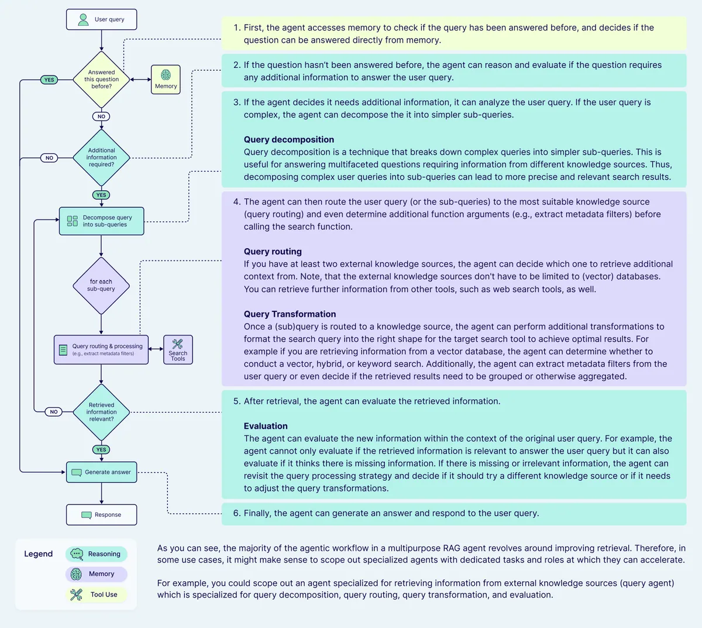

The main loop in agent6.py invokes the four roles in a fixed order each iteration.

The diagram below shows one iteration.

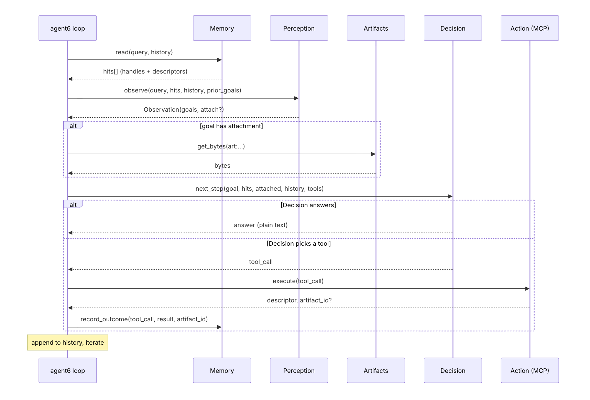

The loop terminates when Perception marks every goal as done.

Three properties of this flow deserve attention. First, Memory is consulted at the start of every iteration. The agent begins each iteration by asking what it already knows before doing any further work. Second, the attachment of artifact bytes to Decision's context is decided by Perception. Decision has no mechanism to request an artifact directly; Perception controls what Decision sees. Third, the Verifier role that lived as a separate LLM call in agent5.py is folded into Perception. Perception re-evaluates the goal list every iteration based on the history; a goal becomes done when Perception observes that the history contains a satisfying action.

# Pydantic Contracts

Every boundary between roles is a Pydantic model. The shapes are kept in schemas.py. The full set is small.

The boundaries between roles are well typed. Memory.read returns list[MemoryItem]. Perception.observe returns Observation. Decision.next_step returns DecisionOutput. Action.execute returns tuple[str, str | None] (descriptor, optional artifact id). The history that the loop accumulates is a list of plain dicts, but every event in the history mirrors one of these typed shapes.

# Memory as a typed service
Memory in the Session 6 architecture is a service. Other roles invoke its read and write methods. The service sits beside the loop as an external store and is called when the loop or another role needs to consult it.

## Kinds

Memory items carry a kind discriminator with four legal values.

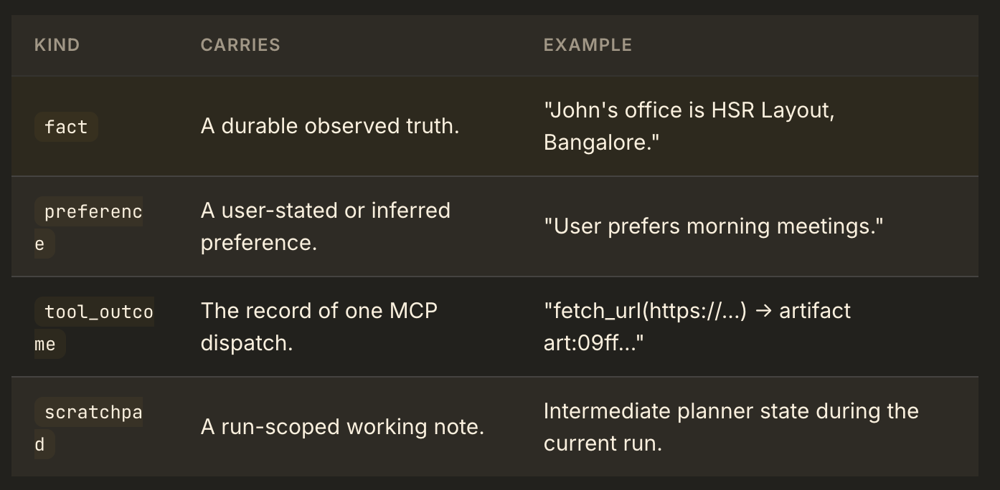

The four kinds map onto the three-tier memory system that Session 7 introduces. The fact items become the Factual layer, the preference items become the REMME layer, and the tool_outcome items become the Episodic layer. The scratchpad is run-scoped and does not migrate. Session 6 keeps all four kinds in a single JSON file. Session 7 will replace the storage backend while preserving the read and write interfaces. Session 7 is future.

## Reads

Three read methods cover the cases that arise in S6. Their cost profiles differ.

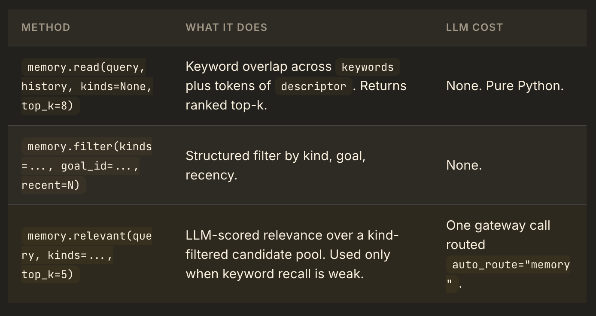

The keyword search uses a small stopword list and a simple lowercase-token intersection. It scales to hundreds of items and stays fast enough to run before every Perception call. The implementation is short. We should be able to read it and understand the algorithm.

## Writes

Two write methods cover the cases. Their cost profiles differ in the same way.

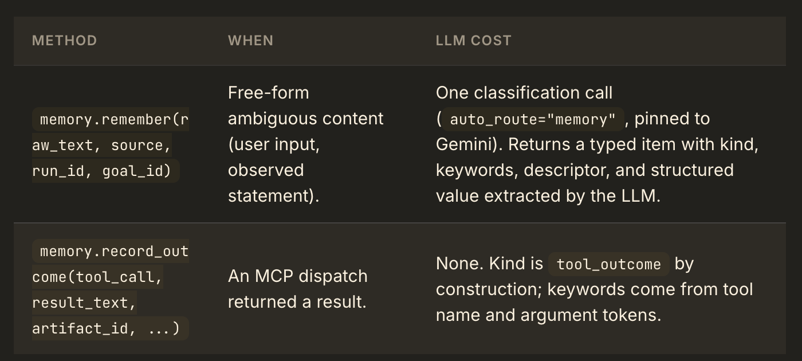

The asymmetry matters. The LLM call at write time is what makes future reads cheap. When a user says "John's birthday is 15 May 2026," the classifier extracts the kind (fact), the canonical structure ({"entity": "John", "attribute": "birthday", "value": "2026-05-15"}), and a keyword list (["John", "birthday", "May", "2026"]). The keyword search at read time then finds this item with no LLM call. The Session 7 expansion will replace keyword search with hybrid retrieval (BM25 plus vector plus reciprocal rank fusion); the interface that Memory.read exposes to other layers does not change.

## Persistence

All items live in a single JSON file at state/memory.json. The agent6 loop loads on first read and writes back after every mutation. Across runs, the same JSON file is reused, so preferences and facts persist. Clearing the file resets the agent.

## Some design notes

Three properties of Session 6 Memory are simplifications.

The Memory implementation in this session does not use embeddings. Keyword overlap is sufficient at the scale a single student's agent reaches. Session 7 introduces embedding-based retrieval and demonstrates the cases where keyword search fails (synonyms, multilingual queries, conceptually similar items that share no surface tokens). The Memory interface that we consume here is identical to the interface S7's implementation exposes, so the code that calls Memory survives the storage change.

Scratchpad as a separate kind is a small fiction. In a strict design, run-scoped working state would live in a separate object and Memory would persist only durable items. The four-kind unification gives us one interface to learn. The scratchpad disappears when the run completes; it is never read by future runs unless an LLM-classified write promotes a scratchpad item to a fact or preference.

Memory in Session 6 has no consolidation loop. A real production agent runs a background process that promotes scratchpad entries to facts when they recur, deduplicates facts that point to the same entity, and expires stale tool outcomes. Session 6 we see the raw record. The recurring assignment expects a clean state/ directory between attempts.

# Artifacts: the parallel store for raw bytes
When a tool produces a payload larger than a few kilobytes, the bytes are written to a separate content-addressable store. Memory holds only the handle.

The distinction is load-bearing. A typical fetched web page is 100 KB or more (though lesser after the cleanup that we have already applied). If those bytes lived inside MemoryItem.value, every subsequent Memory.read would either return them (bloating Decision's context window) or excerpt them (forcing the loop to maintain a second piece of state about which excerpt to use). The artifact store sidesteps the choice by holding the bytes separately and giving Memory a handle.

class ArtifactStore:
    def put(self, blob: bytes, *,
            content_type: str, source: str, descriptor: str) -> str: ...
    def get_bytes(self, artifact_id: str) -> bytes: ...
    def get_meta(self, artifact_id: str) -> Artifact: ...
    def exists(self, artifact_id: str) -> bool: ...

Handles are short strings of the form art:<sha256-prefix>. Storage is two files per artifact under state/artifacts/: a .bin with the raw bytes and a .json with the metadata. The store is content-addressable; identical fetches deduplicate. The store has no eviction policy in S6 (session 6).

The architectural boundary around artifacts is strict.

            ┌──────────────────────────────────────────────────────┐
            │                                                      │
  Memory ◄──┤ holds the handle string ("art:abc...") inside        │
            │ MemoryItem.artifact_id                               │
            │                                                      │
  Perception ◄ sees the handle in MEMORY HITS, never the bytes     │
            │                                                      │
  Decision ◄  sees the bytes only when Perception attaches them    │
            │ to the prompt for the current goal                   │
            │                                                      │
  Action  ◄── produces bytes (writes them via ArtifactStore.put)   │
            │                                                      │
            └──────────────────────────────────────────────────────┘

The boundary is enforced by the agent6 loop. Perception's output includes an optional attach_artifact_id field on each goal. When the next unfinished goal carries such a field, the loop calls ArtifactStore.get_bytes(...) and passes the result into Decision's prompt under an ATTACHED ARTIFACTS: section. Decision sees the section as part of its context window. The reason this matters is cost: a Decision call against a 4 KB context costs a fraction of one against a 200 KB context, and Decision should only pay the larger cost when the work it is doing on this turn requires the bytes.

# Perception: the orchestrator

Perception is the only role that maintains state across iterations. It runs every iteration. Each iteration, Perception receives four inputs: the user's original query, the current memory hits, the run history accumulated so far, and the prior goal list (the Observation it returned on the last iteration). Perception emits a fresh Observation containing the current goal list with done flags and optional artifact attachments.

def observe(
    query: str,
    hits: list[MemoryItem],
    history: list[dict],
    prior_goals: list[Goal],
    run_id: str,
) -> Observation: ...

The decomposition into goals happens the first time Perception runs (when prior_goals is empty). On every later iteration, Perception preserves the goal list shape and updates only the done flags and the attach_artifact_id on the next unfinished goal. This preserves identity across iterations: each goal occupies a stable position in the list, and the loop can refer to a goal by position without relying on the LLM to preserve identifiers.

The contract that Perception fulfills can be stated as four obligations.
1. If the prior goal list is empty, decompose the query into one or more
   bounded goals, each a short imperative statement.

2. For each prior goal, examine the run history. Mark the goal `done: true`
   the moment the history contains an action that satisfies it. Once done,
   the goal remains done in every subsequent iteration.

3. For the first unfinished goal in the list, decide whether it needs raw
   bytes from a previously fetched artifact. If yes, set the goal's
   attach_artifact_id to one of the artifact handles in MEMORY HITS.

4. Preserve goal order. Do not reorder, do not insert in the middle, do
   not drop a goal.

The implementation pins Perception to Gemini through the gateway's provider="g" field. The reason is observed empirically: when Perception is allowed to route through the gateway's normal TINY-tier worker (gpt-4.1-mini at the time of writing), the model is too small to reliably follow the procedure above. It hallucinates attachment ids, drops goals, and produces inconsistent identity across iterations. With Gemini selected explicitly, the procedure executes correctly across the four target queries.

Two structural choices in the prompt prevent hallucination from causing damage.

The first is positional identity. The Perception output schema does not include a goal id field. Goals are identified by their position in the output list. The agent outer loop carries the prior goal ids and maps them to the new positions. The model has no string field where it could invent a stale identifier.

The second is indexed artifact references. Memory hits are presented to Perception with an integer index i on each entry that carries an artifact. The model emits artifact_index: <int> rather than a string handle. The outer loop maps the integer back to the actual art:... handle. A model that wants to attach an artifact must point at one of the indices it actually sees.

Perception also subsumes the role that the structured-output Verifier played in Session 5. There is no separate Verifier call. When Perception re-reads the history at the start of each iteration, it observes whether the last action produced a result that satisfies the open goal, and it sets done: true accordingly. The reasoning that the Session 5 Verifier did inside a typed Verdict model is now done inside Perception's typed Observation model on every iteration.

# Decision: one LLM call, two possible outputs

Decision is the role that selects the next action. It receives one goal, the relevant memory hits, the recent history, optionally the raw bytes of an attached artifact, and the list of available MCP tools. It returns a DecisionOutput containing either a final answer in plain text or a single typed ToolCall. Decision does not pick more than one tool and does not narrate.

def next_step(
    goal: Goal,
    hits: list[MemoryItem],
    attached: list[tuple[str, bytes]],
    history: list[dict],
    mcp_tools: list[dict],
) -> DecisionOutput: ...

The shape of the call is exactly the shape that Session 5 introduced. The gateway is invoked with tools=mcp_tools, tool_choice="auto". When the response contains tool_calls[], Decision returns the first entry wrapped in a ToolCall. When the response contains only text, Decision returns the text as the answer.

The system prompt for Decision contains three substantive instructions.

The first is the choice itself: respond with exactly one of two outputs. Answer or call a tool. The model is not asked to do both.

The second is a rule about artifact handles. The model is told that strings beginning with art: are internal artifact handles. They reference the artifact store. The MCP tools accept real file paths and URLs as their arguments and reject the art: prefix at dispatch time. When a goal requires the bytes of an artifact, those bytes appear in the prompt under ATTACHED ARTIFACTS:. The model reads them there. This rule exists because TINY-tier models occasionally hallucinate that an artifact handle is something to pass to read_file or fetch_url. The Action layer also blocks this at dispatch time; the prompt instruction reduces wasted iterations.

The third is a rule about substantive answers. When the goal asks for an extraction, a list, a comparison, or a selection, the answer must be substantive: at least three sentences or a list of items. This rule exists to prevent the model from returning a meta-answer ("the page has been fetched, how would you like to proceed?") instead of doing the actual work the goal requires.

Decision routes through the gateway with auto_route="decision". The router pool classifies the call and picks a tier. Most Decision calls land on the LARGE-tier Gemini model. Smaller Decision calls (planning a single tool dispatch from a short context) land on TINY-tier workers. The router decision is visible in the gateway's response under router_decision, and on the dashboard at port 8101.

# Action: pure dispatch

Action is the simplest role. It receives a ToolCall and a live MCP session, dispatches the call, and returns a tuple of (descriptor, artifact_id_or_None).

async def execute(
    session: ClientSession,
    tool_call: ToolCall,
) -> tuple[str, str | None]: ...

Action contains no LLM call. The full logic is roughly thirty lines.

Three behaviours matter.

When the tool returns a payload larger than ARTIFACT_THRESHOLD_BYTES (4 KB in this session), Action calls ArtifactStore.put(...) to persist the full bytes and returns a short descriptor of the form [artifact art:abc..., 263507 bytes] preview: .... When the payload is smaller than the threshold, Action returns the text directly and no artifact is created.

When tool_call.arguments contains a path or url value that starts with art:, Action refuses the call and returns an error string explaining that artifact handles are not paths. This guard exists because TINY-tier Decision models occasionally pass an artifact handle to read_file or fetch_url. The guard blocks the dispatch and returns a clear error that the history records, so the next Perception iteration can mark the goal accordingly.

When the tool call is a real MCP dispatch, Action awaits session.call_tool(name, arguments=...), collapses the result's content blocks into a single text string, and proceeds with the threshold check.

The MCP server for Session 6 (in mcp_server.py) exposes nine tools: web_search, fetch_url, get_time, currency_convert, read_file, list_dir, create_file, update_file, edit_file. The full inventory and contracts are documented in the server file itself. Decision sees these nine tools as a tool list and picks one when external work is required.

# Code

MCP server is in mcp_server.py
The LLM gateway is in the llm_gatewayV3 folder

# Agent Loop

The orchestrator in agent6.py ties the four roles together. 

## Five observations

First, the very first thing the loop does after starting is call memory.remember(query, ...). This is the durable-memory contract. When a user types "My mom's birthday is 15 May 2026," the query carries a fact that should survive into future runs. The classification call extracts that fact and persists it. Subsequent runs find it via the keyword search.

Second, the loop reads memory at the top of every iteration. Memory is consulted as a service.

Third, Perception is given the prior_goals list along with the new memory hits and the history. This is what gives goals stable identity across iterations.

Fourth, attachment of artifact bytes is gated on artifacts.exists(...). If Perception emits an attachment handle that does not correspond to a real artifact (a hallucination), the loop silently drops it. The defence is in addition to the position-based artifact_index scheme that prevents most hallucinations at the Perception layer.

Fifth, when Decision returns an answer, the loop appends an answer event to history and continues. Perception, on the next iteration, sees the answer in history and decides whether it satisfies the current goal. Marking goals done is a Perception responsibility. Decision selects actions; it does not declare goals satisfied.

## LLM Gateway (V3)

Every LLM call in the four roles routes through the LLM gateway V3 at http://localhost:8101. The gateway is the same substrate Session 5 introduced, with the V3 additions described in Session 5's gateway README. The relevant features for Session 6 are summarised here.

auto_route and the router pool. When a chat request carries auto_route="perception", auto_route="memory", or auto_route="decision", the gateway runs a small classifier LLM (the router pool) over a bounded envelope containing only the token count and a 800-character sample of the prompt. The classifier returns one of three tier labels (TINY, LARGE, HUGE). The gateway maps the tier to a worker failover order and dispatches the actual call. TINY queries land on small fast workers; LARGE queries land on long-context workers such as Gemini 3.1 flash-lite; HUGE returns 503 with a clear hint to chunk the input.

The separation-of-concerns wall. The router pool never sees the worker's prompt, system, tools, schema, or earlier turns. It receives only {token_count, sample}. The separation is enforced in code. The request envelope sent to the router LLM physically carries only the token count and the 800-character sample. The router cannot leak agentic context into routing decisions because the agentic context never reaches it.

Provider override. A caller can specify provider="g" (or any other shortcut) explicitly. The router is skipped entirely and the named provider becomes the first worker. This session uses the override on every Perception call to send Perception to Gemini. The reason was empirical: the TINY-tier worker that the router selected was too small to reliably follow Perception's multi-step procedure. The override is the gateway feature that was already designed for exactly this case.

Structured output via response_format. Perception and Memory both use this feature. The gateway translates the Pydantic JSON Schema into the per-provider response_format payload, applies the necessary cleaning for each provider, and validates the parsed output server-side. Callers receive a parsed dict already validated against the schema.

The Mermaid diagram below summarises which role talks to which worker in the Session 6 setup.

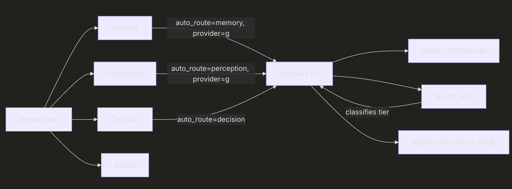

Perception and the Memory classifier both pin to Gemini for reliability. Decision uses the router pool to pick a worker based on the size and structure of the prompt for each call.

## Reading the gateway's honest answers

This section is operational. It addresses a class of bugs that you will hit during your assignment and that look, on the surface, like the gateway is broken. In every case, the gateway is reporting accurately. The reality is that the underlying provider has limited what is available on the free tier.

reasoning_applied: false. When a request carries reasoning="medium" (for example, on a Verifier call), the gateway forwards the reasoning parameter to the worker. Some free-tier models silently ignore the parameter and return a normal completion. The gateway detects this and surfaces reasoning_applied: false in the response. The call itself succeeds; the reasoning knob was a no-op upstream. This is the gateway being honest about what the worker did.

Concrete example: gemini-3.1-flash-lite on the free tier does not honour thinkingBudget. The gateway sets the budget, the model returns text without internal reasoning, the response contains reasoning_applied: false. The fix is either to live with the no-op or to upgrade to a paid-tier model that supports the knob.

cache_read_input_tokens: 0 and cache_creation_input_tokens: 0. The cache_system=True flag asks the gateway to cache the system prompt. Gemini's explicit cache is available on the paid tier; on the free tier, the cache API returns a quota limit of zero and the gateway falls back to no-cache. The response shows zero cache reads and zero cache creations. The system prompt is being sent on every call.

The gateway reports this honestly. Watching the dashboard at port 8101 makes the behaviour visible: cache columns stay at zero across all calls to the Gemini worker.

fallback_used: true in router_decision. The gateway's router pool has four small LLMs (Cerebras llama3.1-8b, Groq llama-3.3-70b-versatile, NVIDIA nemotron-nano-8b, GitHub Phi-4-mini). When all four are rate-limited, in cooldown, or returning errors, the gateway falls back to the deterministic token-count rule. The worker call still proceeds normally. The fallback_used: true flag in router_decision records that no router LLM contributed to the tier choice.

This is normal in heavy use. It is also an observability signal. A run where every iteration shows fallback_used: true indicates that the router pool is overloaded and the system is degrading gracefully.

Gemini 3 loops at low temperature. A finding from the test runs of this session: when Perception sends a structured-output request at temperature=0, Gemini 3.1 flash-lite sometimes emits the same output repeatedly across iterations, in a pattern that suggests internal looping. Raising the temperature to 1.0 eliminates the looping without harming output quality on the four target queries. The Session 6 implementation uses temperature=1.0 on every Perception call for this reason.

The principle. The gateway never lies about what happened upstream. When a feature shows as false or zero in the response, the worker did not honour it. The student's task is to read the response carefully and recognise the gateway as the source of truth about what actually happened. The failure, when it occurs, originates upstream at the provider. Reading these fields on the dashboard during development is the recommended workflow.

# Assignment Goal: Support Four Target Queries

The remainder of this session walks through four queries that exercise different parts of the architecture. These queries are also the test cases for the assignment. Each is presented with the query text, the role progression it triggers, the expected final answer, and the observed iteration count from a clean run of agent6.py.

The traces shown below are real runs. They include the safety nets that the implementation uses (position-based artifact_index, sticky-done, force-attach for synthesis goals, Action's artifact-handle guard).

## Query-1: Shannon Wikipedia (artifact attach test)

Query: Fetch https://en.wikipedia.org/wiki/Claude_Shannon and tell me his
birth date, death date, and three key contributions to information
theory.

This query exercises the artifact attach path. The fetched Wikipedia page is roughly 250 KB of markdown. The artifact store receives the bytes; Memory records the handle; Perception identifies the second goal (extraction) as needing the bytes; the loop attaches them to Decision's prompt for that goal; Decision produces the structured answer.

Sample output:

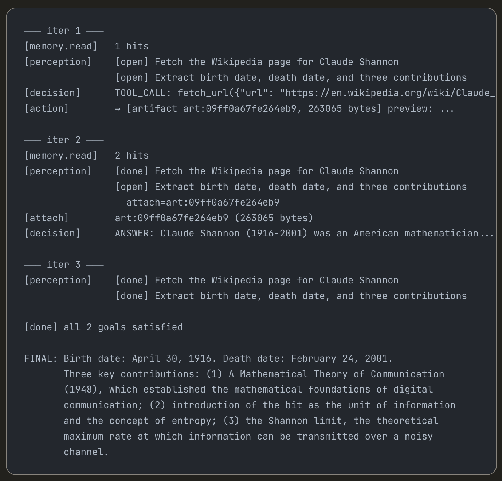

Iteration count: 3. The architecture's central property appears in iter 2: Perception sees the artifact handle in the memory hits and sets attach_artifact_id on goal 2. The loop loads the bytes and Decision answers in one call without re-fetching.

## Query-2: Tokyo activities with weather constraint (multi-goal plus memory carryover)

Query: Find 3 family-friendly things to do in Tokyo this weekend.
Check Saturday's weather forecast there and tell me which one
is most appropriate.

This query has three logical goals: search for activities, fetch the weather forecast for Saturday, select an appropriate activity given the weather. The memory carryover happens between goals two and three: the weather fact recorded by Action is read by Decision when reasoning about which activity fits.

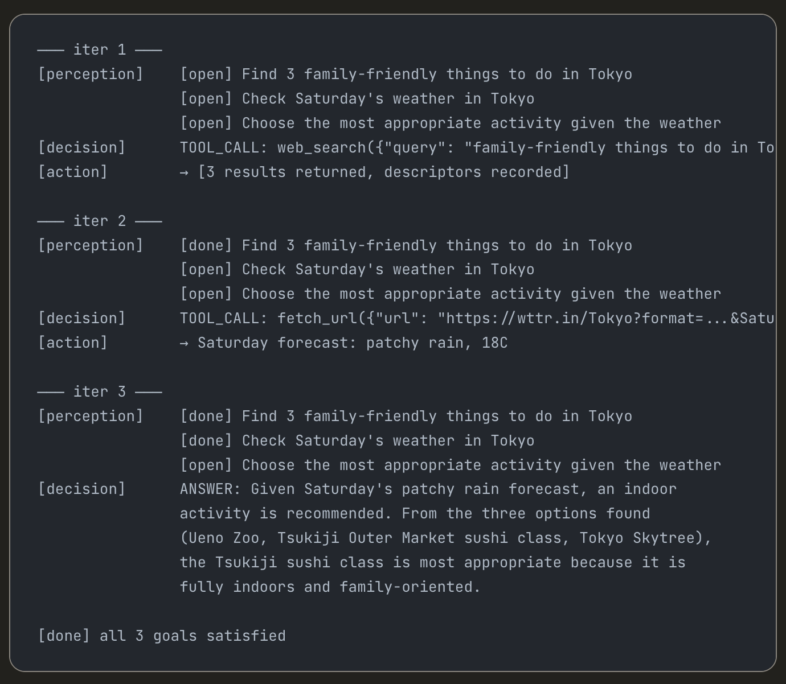

Iteration count: 6 in the observed run including some web-search refinement. Memory carries the weather fact from iter 2 into Decision's context in iter 3 through the keyword search at the top of each iteration.

## Query-3: Mom's birthday (durable memory across two runs)

Query:
Run 1: My mom's birthday is 15 May 2026. Remember that and give me
       a calendar reminder for two weeks before and on the day.

Run 2: When is mom's birthday?

This query exercises the durable-memory contract. The first run classifies the user's statement at the very top of agent6.run(...) via memory.remember(...), producing a fact item with the date and entity extracted. Run 1 then creates reminder files in the sandbox via create_file. Run 2, executed against the same state/ directory, finds the fact through the keyword search and answers directly.

Run 1 trace (abbreviated):

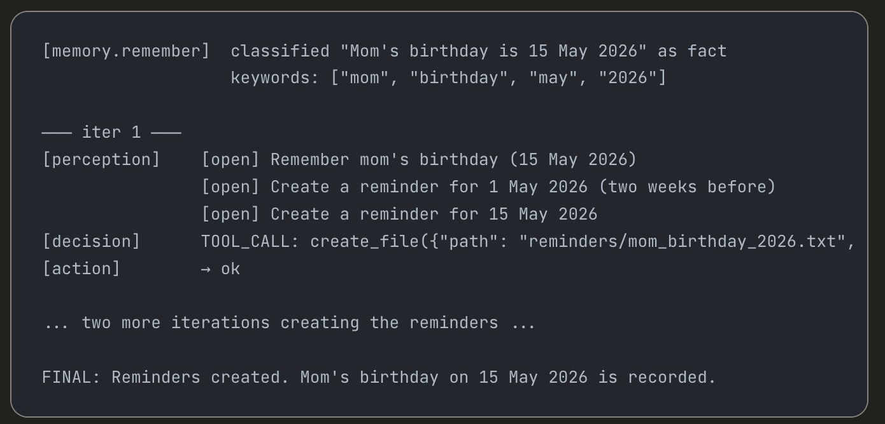

state/memory.json after run 1 contains a fact item with kind="fact", keywords mentioning birthday/mom/may, value containing the date.

Run 2 trace:

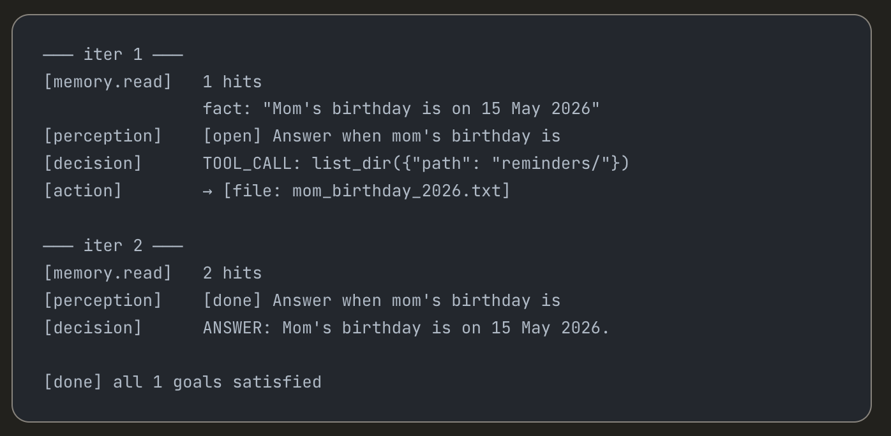

Iteration count: 4 for run 1, 2 for run 2. The fact is carried across run boundaries by the persistent state/memory.json file.

## Query D. Asyncio research (multi-source synthesis)

Query: Search for 'Python asyncio best practices', read the top 3 results,
and give me a short numbered list of the advice they agree on.

This query exercises multi-artifact attachment. The agent performs a web search, fetches each of the top three results (producing three artifacts), and then Perception attaches the relevant ones to a synthesis goal. Decision reads the attached content and produces a consolidated list.

Trace output:

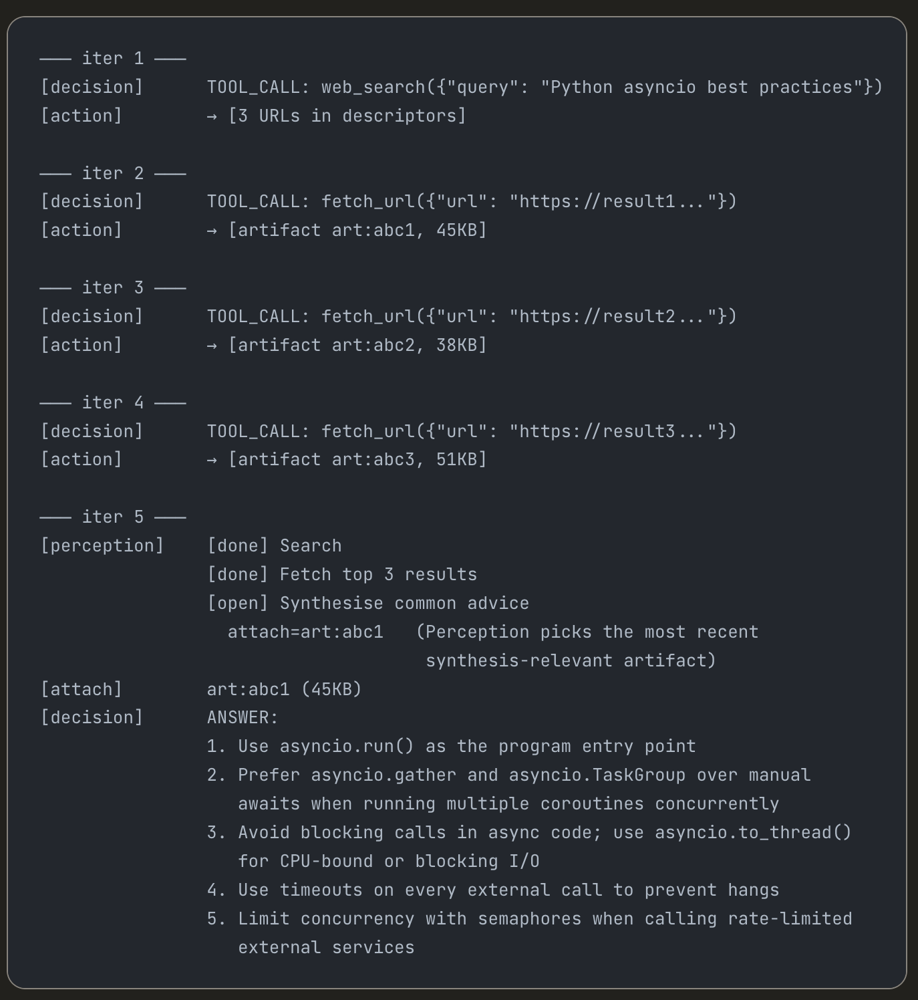

Iteration count: 5 to 7 depending on how many results the agent decides to fetch. Perception's force-attach safety net kicks in for synthesis goals: when the first unfinished goal contains synthesis keywords (synthesise, extract, list, compare, decide) and an artifact exists in memory hits, the implementation attaches the most recent artifact automatically. This guard reduces dependence on the model's reasoning about which artifact is relevant.

# Assignment

Build an agent that passes all four target queries presented in the previous section. The architecture is described above. The implementation is the task in this assignment. Please ask any clarifying questions so that the design can be guided by me.

## Required

Four code modules with clear separation of concerns: memory.py, perception.py, decision.py, action.py. Plus an agent6.py (or any name) that wires them together in a loop. Plus a schemas.py containing the Pydantic models. Plus the MCP server.

All four target queries must produce correct final answers. The expected answers and iteration counts are documented above. Queries that exceed twice the expected iteration count are not considered passing; tune the prompts and the contracts until convergence is within bounds.

Memory must persist across runs in a file under state/. Query-3 requires the durable-memory behaviour: run 1 records the fact, run 2 reads it.

The four cognitive layers must each be backed by typed Pydantic contracts on their inputs and outputs. No free-form dict passing between roles. No regex on LLM output.

The LLM gateway V3 must be the substrate for every LLM call. No direct calls to provider SDKs.

The state/ directory must be cleanable between assignment attempts.

## Constraints

Pydantic v2 on every boundary.

uv for Python dependency management and execution. No manual virtualenv activation should be required.

MCP server stdio transport for tool calls. No reimplementing tool dispatch.

No third-party agentic frameworks (LangGraph, LangChain, CrewAI). The architecture and the contracts are the assignment.

# Responses to Clarifications asked by Claude

  Responses to questions are prefixed with "Response:"

  1. artifacts.py — file-backed or in-memory?
  CLAUDE.md describes .bin/.json files under state/artifacts/ with content-addressing. The current artifacts.py is just an in-memory dict (lost on restart). Should I replace it with the file-backed implementation the spec describes? This
  matters for Query-3 (cross-run persistence) only if an artifact from run 1 needs to survive to run 2 — but for Query-3 that's probably not needed since it's just a date fact.

Response: yes, in the first iteration lets start with in-memory only. We will see if we really need to persist artifacts later.

  2. Dependencies / pyproject.toml
  There's no pyproject.toml at the project root. The CLAUDE.md requires uv. Should I create one? What's already installed — do you have mcp, httpx, pydantic, crawl4ai, tavily-python, duckduckgo-search available, or do I need to spec them all
  out?

Response: There is a .venv folder and a .env file in the llm_gatewayV3 folder. Those are only for the llm_gateway. Anything else that is missing, please create for this project. For example, pyproject.toml and other uv artifacts. Is there anything required in .env?

  3. Perception's artifact_index → artifact_id mapping
  CLAUDE.md says Perception emits an integer index (not the art:... string) to prevent hallucination, and the outer loop maps it to the real handle. But agent6.py already expects obs.goals[i].attach_artifact_id to be the real handle string
  (it calls artifacts.exists(goal.attach_artifact_id) directly). So the mapping from integer → handle string must happen inside perception.py before returning Observation. Is that right — i.e., the LLM prompt internally uses integer indices,
  but perception.py converts them to real art:... strings before returning?

Response: yes, it would be nice to just use an integer as the artifact_index and the artifact_id. That should simplify the mapping as there is no need to manage that explicitly. Will that be ok?

  4. Memory read() — what's in hits?
  The function returns list[dict[str, Any]]. Should that be MemoryItem.model_dump() objects (so Perception and Decision receive serializable dicts), or does it matter?

Response: hits is a json format dictionary with {kind, entity, value} and only those entries that matched the read request. It must also contain artifact handles, if any, have been found to be associated.

  5. .env for API keys
  Is there a .env at the project root (for mcp_server.py which loads from Path(__file__).parent / ".env"), or do I need to create one? The gateway has its own .env in llm_gatewayV3/.

Response: create one. But if you dont have complete information for its contents, please ask.

  6. memory.remember() — which provider?
  CLAUDE.md says "Perception and the Memory classifier both pin to Gemini for reliability." So remember() should use provider="g" with structured output? And what schema — a simple {kind, value, keywords} extraction shape?

  Response: yes, that should suffice